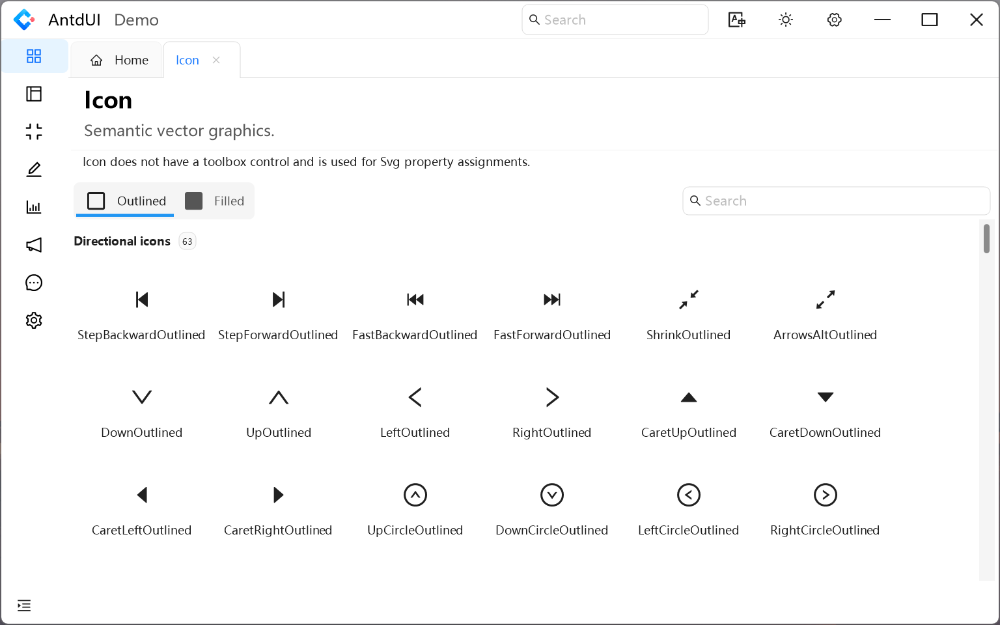

<h1>AntdUI Demo</h1>

This project is developed based on `Winform .NET Framework 4.8`, and is a demo project of [AntdUI](https://gitee.com/antdui/AntdUI), the current version is `1.9.12`

English | <a href="README.md">中文</a>

## ✅ Quick Start

>1. Git clone or download the project directly
>2. Open this project using Visual Studio
>3. If .NET Framework 4.8 is not installed on your computer, edit the project file and set the TargetFramework property to the target framework you installed. Refer to [AntdUI compatible frameworks](https://www.nuget.org/packages/AntdUI#supportedframeworks-body-tab)
>4. Compile and run

## ⚠️ Precautions
- If the computer screen resolution is lower than 1920×1080 (1080P), please use a screen with a resolution greater than or equal to 1080P.
- If `TargetFramework` is set to `net6.0-windows7.0` or later, you can directly open the form interface and display the following prompt

- If the `TargetFramework` is set to `net48` or lower, and the computer screen resolution is greater than 1080P or the scaling is not at 100%, it is essential to open the project using one of the following methods. For detailed reasons, please refer to [Fix HDPI/scaling issues with Windows Forms Designer in Visual Studio](https://learn.microsoft.com/zh-cn/visualstudio/designers/disable-dpi-awareness?view=vs-2022)：
	1. Use the command `devenv /noScale` to start Visual Studio and click on `File - Open - Project/Solution`, as shown below.

	2. Directly open the project, and when prompted on the window page, click **Restart Visual Studio with 100% scaling** as shown below.

## System Settings
- ✅ Support light/dark mode and automatically switch with the system
- ✅ Support enabling/disabling animation effects
- ✅ Support enabling/disabling shadow effects
- ✅ Support for displaying/hiding the scrollbar
- ✅ Support setting the message/notification display position

## Control Demo

### General
#### Button

#### FloatButton

#### Icon

### Layout
#### Divider

#### FlowPanel

#### GridPanel

#### Panel

#### Splitter

#### StackPanel

### Navigation
#### Breadcrumb

#### Dropdown

#### Menu

#### Pagination

#### Steps

### Data Entry
#### Checkbox

#### ColorPicker

#### DatePicker

#### DatePickerRange

#### Input

#### InputNumber

#### Radio

#### Rate

#### Select

#### SelectMultiple

#### Slider

#### SliderRange

#### Switch

#### TimePicker

#### UploadDragger

### Data Display
#### Avatar

#### Badge

#### Calendar

#### Carousel

#### Collapse

#### Label

#### LabelTime

#### Popover

#### Preview

#### Segmented

#### Table

#### Tabs

#### Tag

#### Timeline

#### Tooltip

#### Tour

#### Tree

### Feedback
#### Alert

#### Drawer

#### Message

#### Modal

#### Notification

#### Progress

#### Spin

### Chat
#### ChatList

#### MsgList

### Other
#### Battery

#### ContextMenuStrip

#### Image3D 

#### PageHeader

#### Signal
